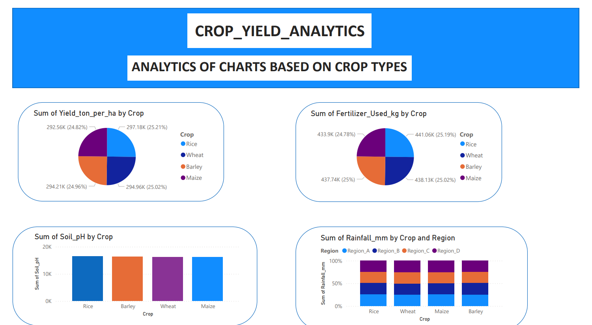
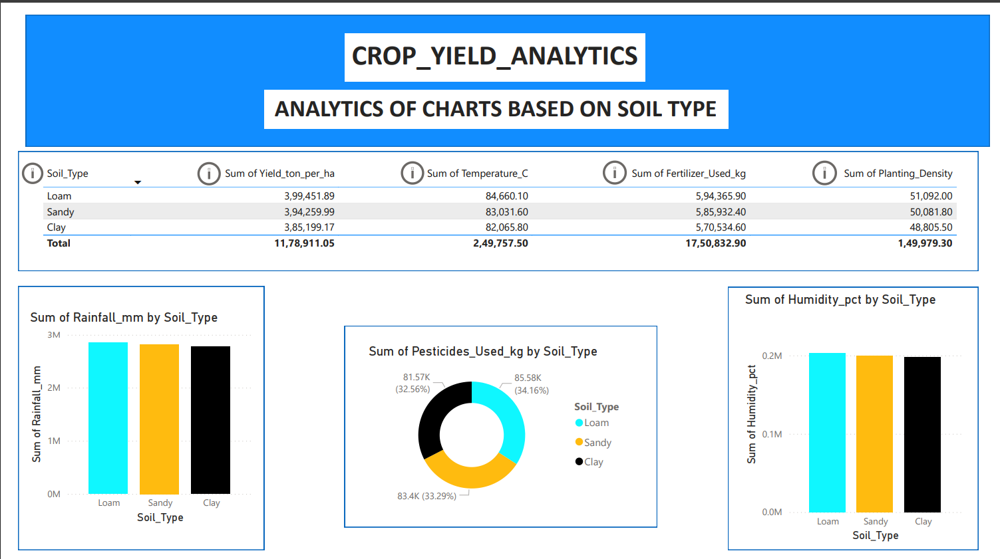
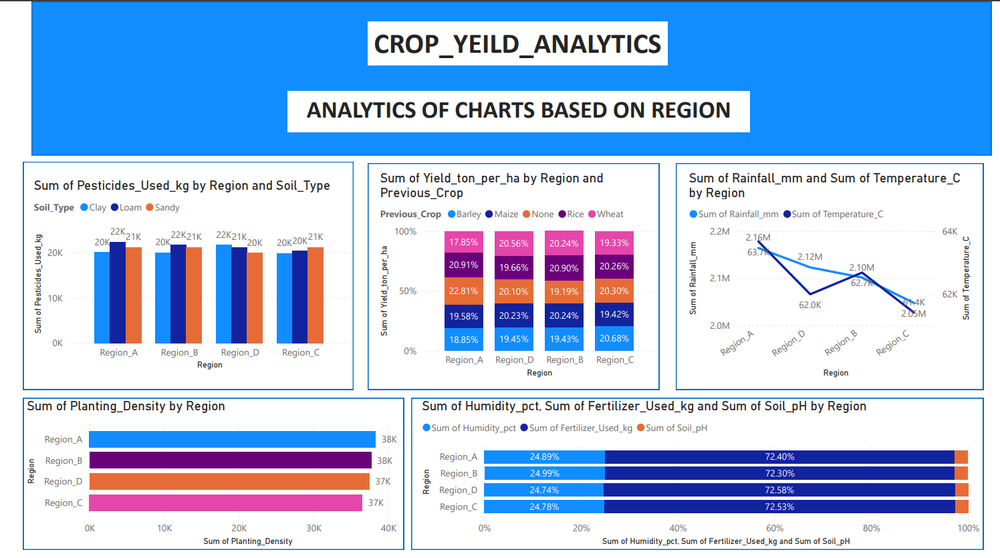

🌾 Crop Yield Analytics Dashboard (SQL + Power BI)

This project analyzes agricultural data to understand the factors influencing crop productivity. The analysis was performed using SQL for data exploration and Power BI for interactive visualization.

🎯 Project Objective

To analyze crop yield trends and identify how soil type, rainfall, temperature, irrigation, fertilizer usage, and regional conditions affect agricultural output.

🛠 Tech Stack

SQL — Data querying and analysis

Power BI — Dashboard visualization

Data Analytics — Trend and pattern analysis

🗂 SQL Data Analysis Performed

Before building the dashboard, SQL was used to analyze the dataset and answer key business questions:

Crop-wise average yield analysis

Region-wise productivity comparison

Soil type impact on crop yield

Irrigation method effectiveness

Rainfall and temperature band analysis

Fertilizer and pesticide efficiency calculations

Previous crop influence on yield

Identification of high-performing crop–region combinations

SQL operations included:

✔ Aggregations (AVG, SUM, COUNT)
✔ Grouping and filtering
✔ CASE statements for segmentation
✔ Subqueries
✔ Data quality checks

📊 Power BI Dashboard Features

The Power BI dashboard provides:

Soil-based yield insights

Crop performance comparison

Region-wise productivity trends

Irrigation and environmental impact analysis

KPI-driven visualization

📂 Dataset

Dataset sourced from Kaggle and analyzed using SQL before visualization.

📈 Outcome

This project demonstrates end-to-end data analysis:

SQL → Data Insights → Power BI Dashboard

## 📊 Dashboard Preview

### Overview

### Soil Type Analysis

### Region Analysis

