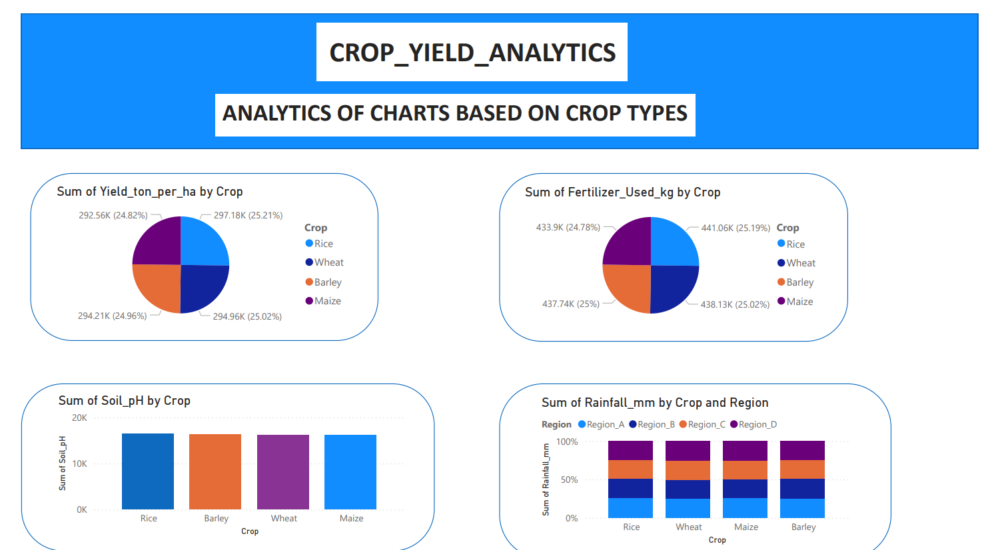
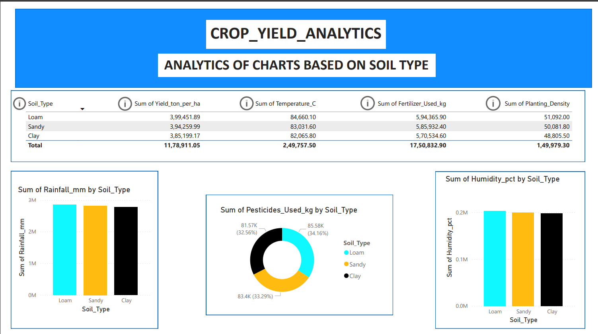
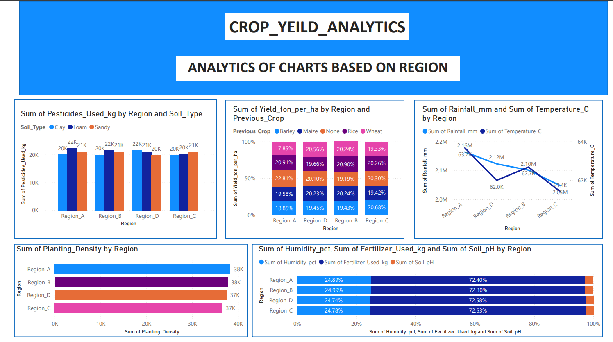

# 🌾 Crop Yield Analytics Dashboard (SQL + Power BI)

This project analyzes agricultural data to understand the factors influencing crop productivity. The analysis was performed using SQL for data exploration and Power BI for interactive visualization.

---

## 🎯 Project Objective

To analyze crop yield trends and identify how soil type, rainfall, temperature, irrigation, fertilizer usage, and regional conditions affect agricultural output.

---

## 🛠️ Tech Stack

| Tool | Purpose |
|---|---|
| SQL | Data querying and exploration |
| Power BI | Interactive dashboard visualization |
| Kaggle | Dataset source |

---

## 🗂️ SQL Analysis Performed

Before building the dashboard, SQL was used to analyze the dataset and answer key business questions:

- Crop-wise average yield analysis
- Region-wise productivity comparison
- Soil type impact on crop yield
- Irrigation method effectiveness
- Rainfall and temperature band analysis
- Fertilizer and pesticide efficiency calculations
- Previous crop influence on yield
- Identification of high-performing crop–region combinations

**SQL operations used:**  
✔ Aggregations (AVG, SUM, COUNT) ✔ Grouping and filtering ✔ CASE statements for segmentation ✔ Subqueries ✔ Data quality checks

📄 Full SQL queries → [`sql_analysis_queries.sql`](sql_analysis_queries.sql)

---

## 📊 Power BI Dashboard Features

- 🌱 Soil-based yield insights
- 🌾 Crop performance comparison
- 🗺️ Region-wise productivity trends
- 💧 Irrigation and environmental impact analysis
- 📈 KPI-driven visualization

---

## 📸 Dashboard Preview

**Overview**

**Soil Type Analysis**

**Region Analysis**

---

## 📈 Outcome

This project demonstrates a complete end-to-end data analysis pipeline:

**SQL → Data Insights → Power BI Dashboard**

---

## 📂 Dataset

Dataset sourced from [Kaggle](https://www.kaggle.com) and analyzed using SQL before visualization.

> ⚠️ Dataset not included — download from Kaggle

---

## 👤 Author

**Shiva Keerth G**  
📧 gantishivakeerth@gmail.com  
🔗 [GitHub](https://github.com/Shiva-keerth) | [LinkedIn](https://www.linkedin.com/in/shiva-keerth-9574b92a6/)
